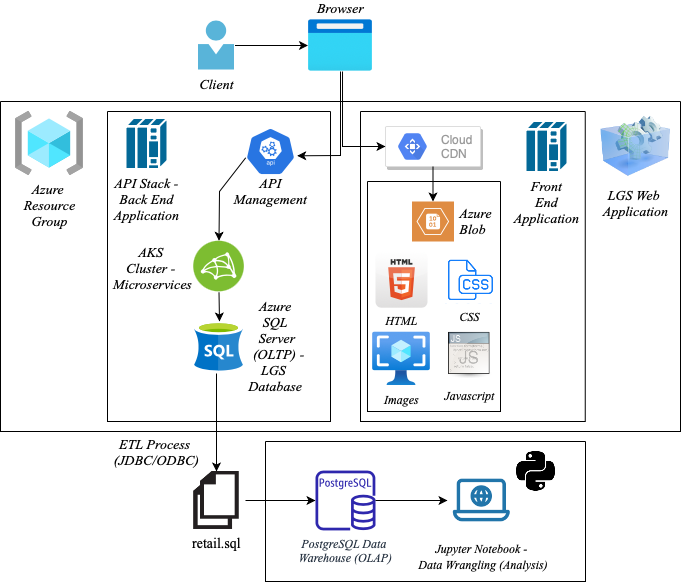

# Python Data Analytics
****
## *Introduction*
The London Gift Shop (LGS) is an online store based in the UK specializing in gift-ware.
Most of their customers are wholesalers. LGS has been operating for ten years, and recently, 
its owner has expressed its lack of growth. The marketing team involved with LGS is interested 
in solving this problem and ultimately promoting economic growth. Ideally, they believe this 
would be done using newer, more innovative technologies and focusing on customer needs. The 
Jarvis consulting team then worked on a proof of concept (PoC) project to help LGS analyze 
their customer behaviour when shopping online. To do this, our team used a transaction dataset
from 01/12/2009 to 09/12/2011, which was stored in a PostgresSQL database. The business needs will 
be fulfilled through utilizing both the PostgresSQL database and Jupyter Notebook, which both have
been provisioned through unique docker containers. To generate business solutions, we 
implemented different programming techniques to process the data and generate
analytical graphs, all run through the Jupyter Notebook.
## *Implementation*
****
### Project Architecture
The IT team at LGS pulls all transactional data between 01/12/2009 and 09/12/2011 from their 
Azure system and then provides Jarvis with a transaction dataset of this data, loaded onto a 
PostgreSQL database. This is done because the Jarvis Consulting team does not have permission to access 
the Azure environment but needs this data to solve the business questions at hand. These 
solutions are drafted using both the dataset and data analysis tools.
### Diagram

### Data Analytics and Wrangling
- All data analytics and wrangling processes were processed through the [Jupyter Notebook](./python_data_wrangling/data/retail_data_analytics_wrangling.ipynb).
- To address the lack of financial growth that LGS is facing, our team at Jarvis consulting 
suggests that the company looks into the spending habits of newer customers. Assessing their 
gift trend can then fuel the company to promote specific products that are being consumed 
regularly. This promotion, alongside possible discounts on these items, will turn newer 
customers into existing, long-term ones. 
- By analyzing the month-to-month trends, it is clear that there is a significant increase 
in revenue at the end of every quarter. Pinpointing the root of that increase and using 
newer marketing strategies to promote those heavily-consumed products will also allow for 
an influx of profit. 
## *Improvements*
- To perform a more detailed analysis of LGS's consumer audience, using greater, more recent
sample sizes of data would be recommended.
- We suggest that the LGS team also analyze any age-specific trends.
- Regarding cancelled orders, we think that it is also essential to assess which items are 
being cancelled and their respective data sets.